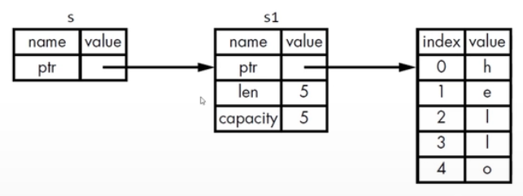

# 引用和借用

## 引用

```rust
fn main() {
    let s1 = String::from("Hello");
    let len = calculate_length(&s1);

    println!("The length of '{}' is {}.", s1, len);
}

fn calculate_length(s: &String) -> usize {
    s.len()
} // s不拥s1的所有权
```
参数的类型是`&String`而不是`String`。

`&`符号就表示引用：允许你引用某些值而不取得所有权。

<p align='center'>
    
</p>

## 借用

我们把引用作为函数参数这个行为叫做借用。

不可以修改借用的东西，和变量一样，引用默认也是不可变的。

可变引用有一个重要的限制：在特定作用域内，对某一块数据，只能有一个可变的引用。
* 这样做的好处是可在编译时防止数据竞争。

以下3种行为下会发生数据竞争：
* 两个或多个指针同时访问同一个数据
* 至少有一个指针用于写入数据
* 没有使用任何机制来同步对数据的访问

可以通过创建新的作用域，来允许非同时的创建多个可变引用。

```rust
fn main() {
    let mut s = String::from("Hello");
    {
        let s1 = &mut s;
        println!("{}", s1);
    }
    let s2 = &mut s;
    println!("{}", s2);
}
```
## 另外一个限制

不可以同时拥有一个可变引用和一个不可变的引用。多个不变的引用是可以的。

```rust
fn main() {
    let mut s = String::from("Hello");
    let r1 = &s;
    let r2 = &s;
    let s1 = &mut s; // s已经被借用为不可变的引用
    //  cannot borrow `s` as mutable because it is also borrowed as immutable
    println!("{}, {}, {}", r1, r2, s1);
}
```
## 悬空引用

悬空指针（Dangling Pointer）：一个指针引用了内存的某个地址，而这块内存可能已经释放并分配给其它人使用了。

在Rust里，编译器可保证引用永远都不是悬空引用：
* 如果你引用了某些数据，编译器将保证在引用离开作用域之前数据不会离开作用域。

```rust
fn main() {
    let r = dangle();
}

fn dangle() -> &String {
    let s = String::from("hello");
    &s // 引用有效，但是s在花括号之后出了生命周期。此时引用走向一个空域。
}
```
## 引用的规则

在任何给定的时刻，只能满足下列条件之一：
* 一个可变的引用
* 任意数量不可变的引用

引用必须一直有效。