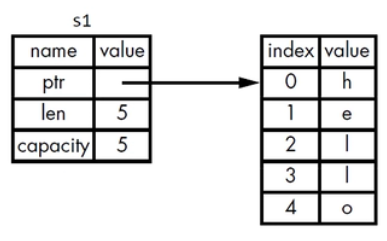
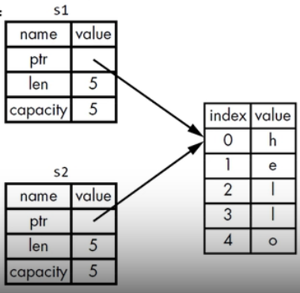
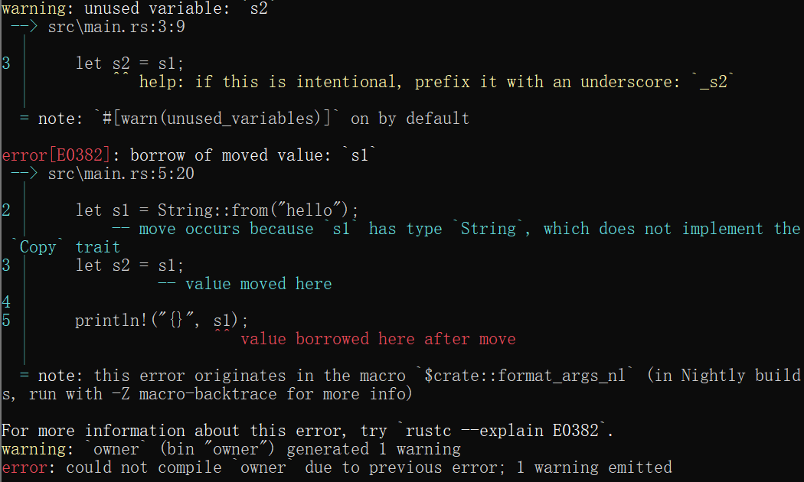
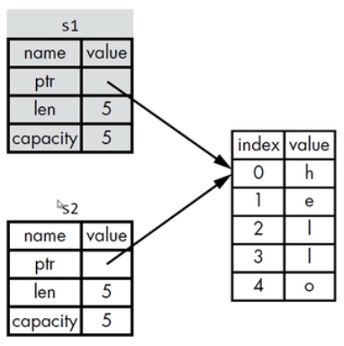
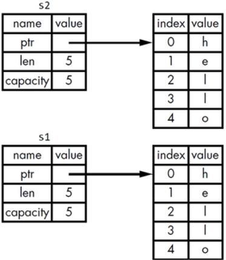

# 所有权规则、内存与分配

## 所有权规则

每个值都有一个变量，这个变量是该值的所有者。

每个值同时只能有一个所有者。

当所有者超出作用域（scope）时，该值将被删除。

## 变量作用域

Scope是程序中一个项目的有效范围

```rust
fn main() {
    // s 不可用
    let s = "hello"; // s 可用
                    // 可以对 s 进行相关操作
} // s 的作用域到此结束，s 不再可用
// s会保持自身的有效性，直到自身的作用域结束为止。
```

## String类型

String 比那些基础标量数据类型更复杂。

基础标量数据类型存在在Stack上，它们在离开自己作用域的时候，数据就会弹出栈。 

String类型存放在heap上。 string类型可以代表标准库中或者自己创建的其它复杂数据类型。

字符串字面值：程序里手写的那些字符串值，它们**不可变**的。

Rust还有第二种字符串类型：String
* 在heap上分配，能够存储在编译时未知数量的文本。

### 创建String类型的值

可以使用from函数从字符串字面值创建出String类型

```rust
let s = String::from("hello");
```
"::"表示from是String类型下的函数

这类字符串是可以被修改的。

```rust
fn main() {
    let mut s = String::from("Hello");

    s.push_str(", World");

    println!("{}", s);
}
```

因为处理的方式不同，所以String类型可以修改，但是字符串字面值不可以修改。

### 内存和分配

字符串字面值，在编译时就知道它的内容了，其文本内容直接被硬编码到最终的可执行文件里
* 速度快、高效。因为其不可变性。

String类型，为了支持可变性，需要在heap上分配内存来保存编译时未知大小的文本内容：
* 操作系统必须在运行时来请求内存（这一步通过调用`String::from`来实现）

当用完`String`之后，需要使用某种方式将内存返回给操作系统。（在拥有GC的语言中，GC会跟踪并清理不再使用的内存，如Java, C#。没有GC的语言中，就需要我们去识别内存何时不再使用，并调用代码将它返回。）
* 如果忘了，那么会浪费内存
* 如果提前做了，变量就会非法
* 如果做了两次，也是bug，必须一次分配对应一次释放。

Rust采用了不同的方式，对于某个值来说，当拥有它的变量走出作用范围时，内存会立即自动的交还给操作系统。

```rust
fn main() {
    let mut s = String::from("Hello");

    s.push_str(", World");

    println!("{}", s);
} // s 的作用域结束
```
当变量走出作用域的时候，Rust会自动调用drop函数。 

## 变量和数据交互的方式

### 移动（Move）

多个变量可以与同一个数据使用一种独特的方式来交互

```rust
let x = 5;
let y = x;
```

整数是已知且固定大小的简单值，这两个5被压到了stack中。

String版本：

```rust
let s1 = String::from("hello");
let s2 = s1;
```

一个String类型由`3`部分组成：
* 一个指向存放字符串内容的内存的指针
* 一个长度
* 一个容量

<p align='center'>
    
</p>

长度len，就是存放字符串内容所需的字节数。

容量capacity是指String从操作系统总共获得内存的总字节数。

当把s1赋给s2，String的数据被复制了一份：
* 在stack上复制了一份指针、长度、容量
* 并没有复制指针所指向的heap上的数据

当变量离开作用域时，Rust会自动调用drop函数，并将变量使用的heap内存释放。

<p align='center'>
    
</p>

当s1、s2离开作用域时，它们都会尝试释放相同的内存：
* 二次释放（double free） bug

为了保证内存安全：
* Rust没有尝试复制被分配的内存
* Rust让s1失效（当s1离开作用域的时候，Rust不需要释放任何东西）

```rust
fn main() {
    let s1 = String::from("hello");
    let s2 = s1;

    println!("{}", s1); // 此时s1已经失效
}
```

<p align='center'>
    
</p>

浅拷贝（shallow copy）

深拷贝（deep copy）

你也许会将复制指针、长度、容量视为浅拷贝，但由于Rust让s1失效了，所以我们用一个新的术语：移动（Move）。

由于s1已经失效了，所以只会释放一次空间。

<p align='center'>
    
</p>

隐含的一个设计原则：Rust不会自动创建数据的深拷贝
* 就运行时性能而言，任何自动赋值的操作都是廉价的。

### 克隆（Clone）

如果真想对heap上面的String数据进行深度拷贝，而不仅仅是stack上的数据，可以使用clone方法。

```rust
fn main() {
    let s1 = String::from("hello");
    let s2 = s1.clone();

    println!("{}, {}", s1, s2);
}
```

<p align='center'>
    
</p>

clone的是heap上的资源，比较消耗空间。

## Stack上的数据：复制

Copy trait，可以用于像整数这样完全存放在stack上面的类型

如果一个类型实现了Copy这个trait，那么旧的变量在赋值后仍然可用

如果一个类型或者该类型的一部分实现了Drop trait，那么Rust不允许让它再去实现Copy trait了。

## 一些拥有Copy trait的类型

任何简单标量的组合类型都可以是Copy的。

任何需要分配内存或某种资源的都不是Copy的。

所有的整数类型，例如u32

bool

char

所有的浮点类型，例如f64

Tuple（元组），如果其所有的字段都是Copy的
* (i32, i32) 是可以Copy的
* (i32, String)不是可以Copy的